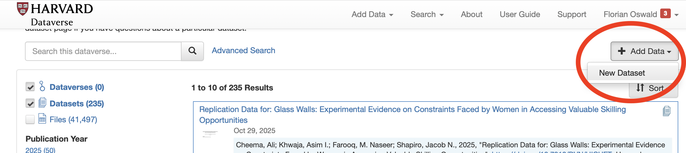
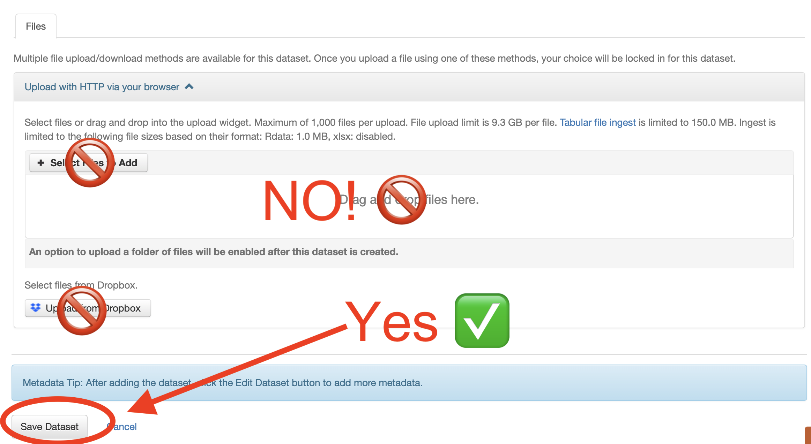
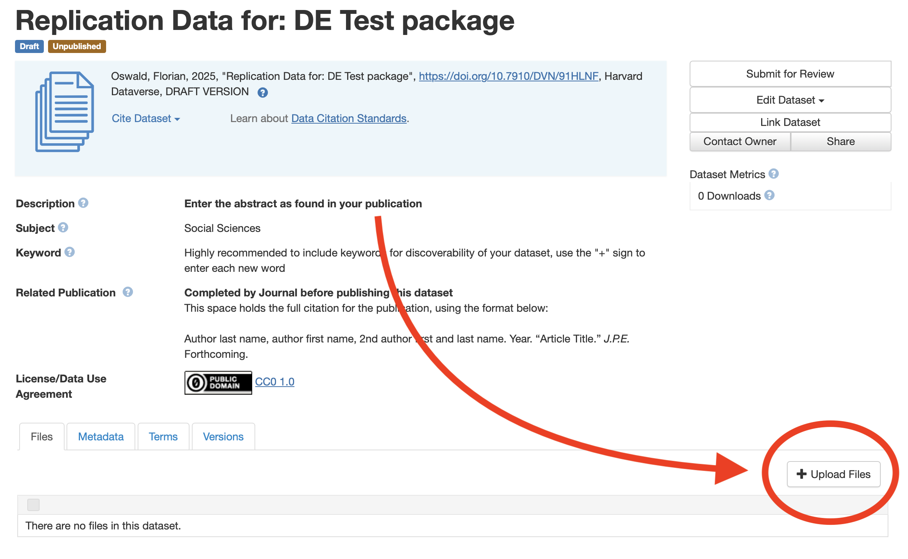
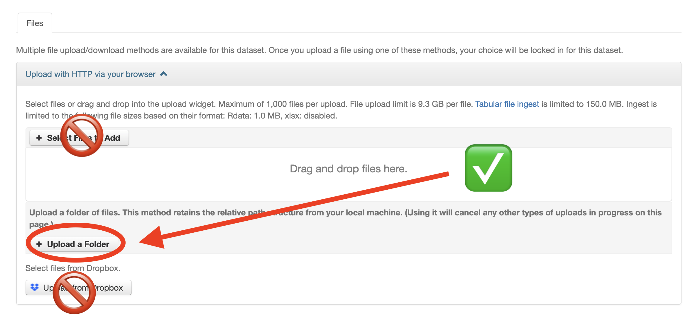
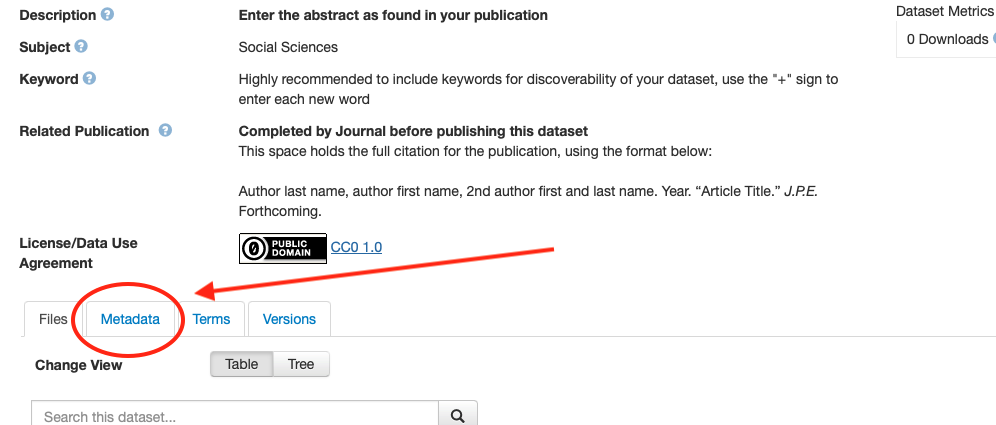
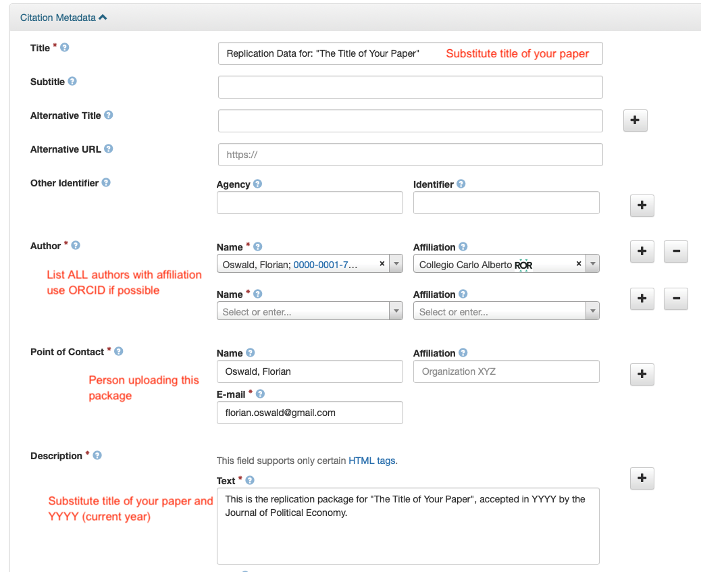
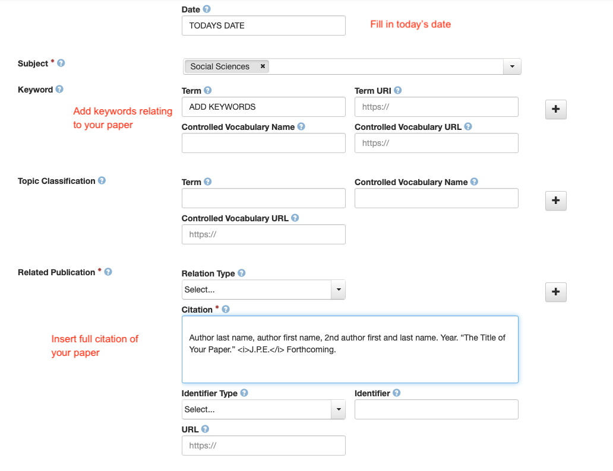
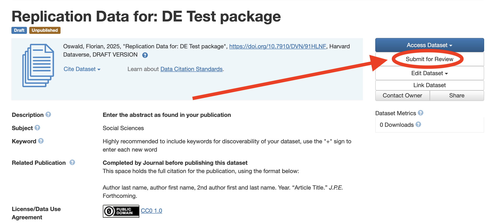

## Package Structure {#sec-structure}

Your package should be submitted as a single `zip` file. While we do not enforce any particular structure for the contents of this archive, we ask you to observe a few simple rules for operational reasons:

1. At the root of your package, there **must** be a `README` file in suitable format (`.txt`, `.md` or `.pdf`). We do not accept supplementary `README` files in other locations of the package - There should be a unique point for all required documentation.
2. You should clearly separate input, output and code in your package.
3. If your package depends on confidential data which you can share only on a temporary basis with the Data Editor, clearly separate this from the public data in your package in order to avoid mistaken publication of such data. We recommend to call this folder `confidential-data-not-for-publication`.
4. If the content of your package is larger than 10GB, zip compression becomes unstable. Please reach out to the Data Editor to agree on a way of splitting the content across multiple compressed files. In general, we aim for the smallest possible number of zip files below a 10GB threshold.


### Some Examples

Here are three examples for potential package structures. *This is what we see after we `unzip` your package*.


::: {.columns}
::: {.column width=33%}
**Example 1 ✅**

```
.
├── README.md
├── code
│   ├── R
│   │   ├── 0-install.R
│   │   ├── 1-main.R
│   │   ├── 2-figure2.R
│   │   └── 3-table2.R
│   ├── stata
│   │   ├── 1-main.do
│   │   ├── 2-read_raw.do
│   │   ├── 3-figure1.do
│   │   ├── 4-figure2.do
│   │   └── 5-table1.do
│   └── tex
│       ├── appendix.tex
│       └── main.tex
├── data
│   ├── processed
│   └── raw
└── output
    ├── plots
    └── tables
```
:::

::: {.column width=33%}
**Example 2 ✅**
```
.
├── README.pdf
├── code
│   ├── R
│   └── fortran
├── data
│   ├── processed
│   └── raw
├── confidential-data-not-for-publication
│   ├── processed
│   └── raw
└── output
```

`confidential-data-not-for-publication` is for Data Editor only.
:::

::: {.column width=33%}
**Example 3 ❌**
```
.
├── README.docx
├── 20211107ext_2v1.do
├── 20220120ext_2v1.do
├── 20221101wave1.dta
├── matlab_fortran
│   ├── graphs
│   ├── sensitivity1
│   │   ├── data.xlsx
│   │   ├── good_version.do
│   │   └── script.m
│   └── sensitivity2
│       ├── models.f90
│       ├── models.mod
│       └── nrtype.f90
├── readme.do
├── scatter1.eps
├── scatter1_1.pdf
├── scatter1_2.pdf
├── ts.eps
├── wave1.dta
├── wave2.dta
├── wave2regs.dta
└── wave2regs2.dta
```

The Data Editor would ask you to improve the structure of this package: First, the readme is in the wrong format, second, input, output and code are mixed.
:::
:::


Keep in mind that you can only include folder `confidential-data-not-for-publication`, if you have previously applied for exemption to the Data and Code Policy. There are relevant FAQs [here](before.qmd#apply-to-exemptions-to-the-data-and-code-availability-policy), [here](faqs.qmd#data-and-code-availability-policy-and-exemptions), and [here](faqs.qmd#procedures-when-exemptions-are-granted).


## Contents of Replication Package

As indicated in the journal's [Data and Code Availability Policy](https://www.journals.uchicago.edu/journals/jpe/datapolicy) all packages should include the following material: 

* A `README` file in PDF format (`README.pdf`). We strongly recommend using [this template](https://social-science-data-editors.github.io/template_README/).  You may find in [this web app](https://www.templatereadme.org/) a convenient tool to create your `README` file. The minimally required content of the readme is specified [here](policy.qmd#sec-readme). A comprehensive list is given below in @sec-package-readme.
* The **raw datasets** used in the paper and online appendices, including a complete, transparent and precise documentation describing all variables. You can additionally provide the analysis data if this is helpful, but they are not required if the raw data are provided. 
* If you were granted a data exemption at the time of first submission (see [here](before.qmd#apply-to-exemptions-to-the-data-and-code-availability-policy), [here](faqs.qmd#data-and-code-availability-policy-and-exemptions), and [here](faqs.qmd#procedures-when-exemptions-are-granted) for details), you should either provide the replication team with **temporary access** to the data for the sole purpose of performing the reproducibility checks, or you should submit a **synthetic/simulated** dataset that allows running the code and produce all outputs in the paper and appendices, even if the results do not match those in the paper. If you can provide temporary access but you cannot share the data in the `confidential-data-not-for-publication` folder, please contact the Data Editor at  to arrange an alternative access method. The content of this folder will be destroyed after the reproducibility checks are completed. All replicators and the Data Editor have signed confidentiality agreements that protect your submission.
* Both the data cleaning codes and the analysis codes that produce all reproducible outputs reported in the article, appendix, and online appendices (including figures, tables, and numbers reported in the text). If some results are produced without scripts (e.g. ArcGIS maps), the `README` file should include step-by-step _very detailed instructions_ on how to produce that output. In case of simulation/Monte Carlo studies, the authors are requested to set a seed so that the exact numbers that are reported can be obtained.
* If data are provided in proprietary format (e.g. Stata's `.dta`), a copy of the data in non-proprietary format (e.g. `ASCII`, `.csv`).

**Experimental papers** should additionally include the following PDF documents (if these files are part of the paper or of an appendix, copy them again in a separate document and include them in the replication package): 

1. A document outlining the **design** of the experiment.
2. A copy of the **instructions** given to participants, in both the original language and an English translation.
3. Information on the **selection and eligibility** of participants.
4. A PDF copy of the **Institutional Review Board (IRB) approval** of one of the authors' institutions (IRB approval number, date, name of the institution) or an explicit mention that an exemption has been granted by the Editorial Board.


## The `README` File {#sec-package-readme}

The `README` file should provide enough instructions so that all users (level of an advanced PhD student and above) can reproduce all the results in the paper in a reasonable amount of time and without problems. We strongly recommend using [this template](https://social-science-data-editors.github.io/template_README/). You may find in [this web app](https://www.templatereadme.org/) a convenient tool to create your `README` file. The **minimum required information includes**: 


1. A **verbal description** of the content of the package (datasets, programs, folders, etc.)
2. **Data Availability Statement**: precise indications on how the data were obtained, including required registrations, memberships, application procedures, monetary cost, or other qualifications, and, if applicable, URL to download them (which is typically part of the data citation).
3. The following **Statement about Rights**: 
   - [ ] I certify that the author(s) of the manuscript have legitimate access to and permission to use the data used in this manuscript.
   - [ ] I certify that the author(s) of the manuscript have documented permission to redistribute/publish the data contained within this replication package. Appropriate permission are documented in the LICENSE.txt file (if applicable).
4. Precise **instructions** on how to run the code.
5. Indications on where each piece of output is saved or displayed. 
6. **Software requirements**, including the software version and operating system used by the authors.
7. All **packages and libraries** that need to be installed to run the code and a clear indication on how to obtain them.
8. **Expected running time** (even if it is a few seconds). When relevant, include the hardware that the estimated time refers to.
9.  **Data citations**: all datasets used in the paper (with no exceptions) should be listed in the references section of the paper in the same way that we cite other papers, and a copy of these citations should appear in a dedicated section of the ReadMe file. You can find some examples [here](https://social-science-data-editors.github.io/guidance/addtl-data-citation-guidance.html).

## Data Citations

All datasets used in the paper (with no exceptions) should be listed _in the references section of the paper_ in the same way that we cite other papers, and a copy of these citations should appear in a dedicated section of the `README` file.

If the data used in the study is part of the replication package of another paper, both the paper and the replication package should be cited. 

::: {.callout-note}
# Data Citations Are Important!

Even commonly used datasets should be cited (in fact, funding of public and private institutions that make datasets available, even the most widely used ones, crucially depends on data citations!).
:::

More specific guidance, and examples, on data citations is available [here](https://social-science-data-editors.github.io/guidance/addtl-data-citation-guidance.html). 


## Submitting Your Package

You will be *invited* to submit your package via an upload link by the Data Editor. This invitation will be generated *after* you have submitted the electronic form in your conditional acceptance email.

A few days after you submitted the package (in most of the cases, within two weeks) you will be contacted by the Data Editor with the outcome of the reproducibility checks, regardless of whether the checks were successful or there are modifications to be made. **Please add  and to your safe contacts to avoid that the Data Editor's messages go to spam!**

If you need to implement modifications of your package, you will be instructed to do so in the Data Editor's response. You will iterate with the Data Editor until the reproducibility checks are satisfactorily concluded.


## After the reproducibility checks are completed: publish your package!

Once the reproducibility checks are concluded, and upon invitation of the Data Editor, you will be requested to perform a final step:  publish your replication package at the [JPE Dataverse](https://dataverse.harvard.edu/dataverse/JPE). To do so, you need to perform the following steps: 

::: {.extrapad}

1. Sign up [here](https://dataverse.harvard.edu/dataverse/JPE) for a free account, if you don't have one already.
2. Log in to your account.
3. Make sure you are on the [JPE Dataverse](https://dataverse.harvard.edu/dataverse/JPE) and not the generic dataverse (you need to see the JPE green banner on top). Click on *Add Data > New Dataset*. 
4. Fill in all required but **do not add any data** at this step. Instead, click on *Save Dataset*. 
5. Your deposit will be created. Now you can select *Upload Files*. 
6. On the resulting screen, it is **compulsory** to select the *Upload a Folder* button and to upload **in uncompressed format** the *exact same package* which the Data Editor sign off on (again, only difference is that your package is not compressed here). The correspondence between uploaded and accepted package will be checked automatically. Uploading files is limited to less than 1000 files per upload, a maximum file size of 9.3BG per file, and a total transfer time per upload of less than 60 minutes. You can perform multiple uploads. If you experience issues with this, please contact the data editor! 
7. ⚠️ **Do not include the content of the `confidential-data-not-for-publication` folder**!
8. After the folder upload has finished, reload the dataverse page of your deposit. Check your files are visible at the bottom. 
9. Fill in *the required metadata*! Click on the *metadata* tab, then on *edit/add metdata* on the right. 
10. Everything in *red* below needs to be filled out.  
11. Finally, Click on *Submit for Review*. 
12. After verification of your deposit by the Data Editor, your package will be published on the JPE dataverse, and the process of reproducibility checks comes to an end.

:::
